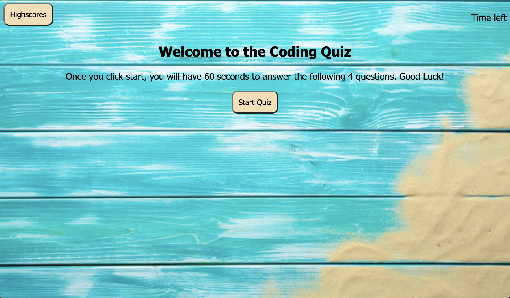

# <Code-Quiz>

## Deployed link to application

https://kboksa.github.io/code-quiz/

## Description

- My motivation for this project was to create a quiz on JavaScript
- I build the project to test users JavaScript skills
- This project helped me learn how to create a timer in a browser

## Usage

This website helps users test the JavaScript skill. The user has 60 second to complete 4 questions. They are able to keep track of their score using the highscore board. The user will automatically lose if the time is up.

## Credits

Kalina Boksa
